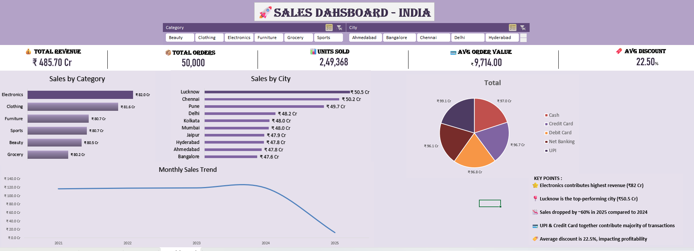

#  Sales Dashboard (Excel Project)

**created by Jatin singh**

##  Overview

This project is an interactive sales dashboard built using Microsoft Excel to analyze sales performance across categories, cities, and payment methods.

##  Tools Used

* Microsoft Excel
* Pivot Tables
* Slicers
* Charts

##  Key Features

* Interactive filtering using slicers
* KPI tracking (Revenue, Orders, Units Sold, AOV)
* Sales trend analysis
* Category and city performance

##  Key Insights

* Electronics is the top-performing category
* Lucknow generates highest revenue
* Sales dropped significantly in 2025
* UPI & Credit Card dominate transactions

##  Dashboard Preview

